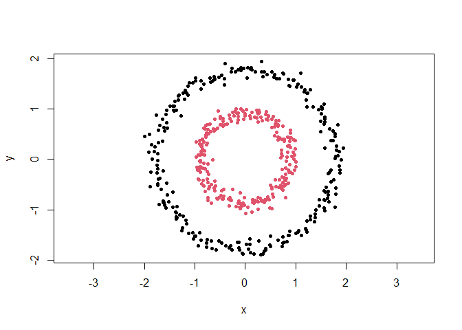
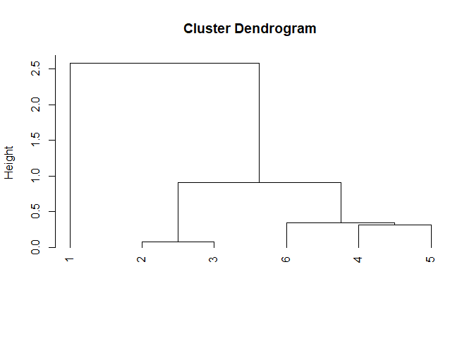

<!-- README.md is generated from README.Rmd. Please edit that file -->

# clustlearn

The goal of clustlearn is to provide a set of functions to perform
clustering analysis along with comprehensive explanations of the
algorithms, their pros and cons, and their applications.

## Installation

You can install the released version of clustlearn from
[CRAN](https://CRAN.R-project.org) with:

``` r
install.packages("clustlearn")
```

You can install the development version of clustlearn from
[GitHub](https://github.com/) with:

``` r
devtools::install_github("Ediu3095/clustlearn")
```

## Example

This is a basic example which shows you how to cluster a dataset:

``` r
# # Load the clustlearn package
# library(clustlearn)

# Perform the clustering (the clustlearn:: prefix is not necessary)
cl <- clustlearn::dbscan(clustlearn::db1, 0.3)

# Plot the results
out <- cl$cluster == 0
plot(clustlearn::db1[!out, ], col = cl$cluster[!out], pch = 20, asp = 1)
points(clustlearn::db1[out, ], col = max(cl$cluster) + 1, pch = 4, lwd = 2)
```

<!-- -->

This is yet another basic example which shows you how to see the
step-by-step procedure of the clustering algorithm:

``` r
# # Load the clustlearn package
# library(clustlearn)

# Perform the clustering (the clustlearn:: prefix is not necessary)
# The details argument is set to TRUE to see the step-by-step procedure
cl <- clustlearn::agglomerative_clustering(
  clustlearn::db5[1:6, ],
  'single',
  details = TRUE,
  waiting = FALSE
)
```

    ## ________________________________________________________________________________

    ## EXPLANATION:

    ## 

    ## The Agglomerative Hierarchical Clustering algorithm defines a clustering hierarc

    ## hy for a dataset following a `n` step process, which repeats until a single clus

    ## ter remains:

    ## 

    ##     1. Initially, each object is assigned to its own cluster. The matrix of dist

    ##     ances between clusters is computed.

    ##     2. The two clusters with closest proximity will be joined together and the p

    ##     roximity matrix updated. This is done according to the specified proximity.

    ##     This step is repeated until a single cluster remains.

    ## 

    ## The definitions of proximity considered by this function are:

    ## 

    ##     1. `single`. Defines the proximity between two clusters as the distance betw

    ##     een the closest objects among the two clusters. It produces clusters where e

    ##     ach object is closest to at least one other object in the same cluster. It i

    ##     s known as SLINK, single-link or minimum-link.

    ##     2. `complete`. Defines the proximity between two clusters as the distance be

    ##     tween the furthest objects among the two clusters. It is known as CLINK, com

    ##     plete-link or maximum-link.

    ##     3. `average`. Defines the proximity between two clusters as the average dist

    ##     ance between every pair of objects, one from each cluster. It is also known

    ##     as UPGMA or average-link.

    ## 

    ## ________________________________________________________________________________

    ## STEP 1:

    ## 

    ## Initially, each object is assigned to its own cluster. This leaves us with the f

    ## ollowing clusters:

    ## CLUSTER #-1 (size: 1)
    ##           x         y
    ## 1 -1.578117 -1.292868
    ## CLUSTER #-2 (size: 1)
    ##           x        y
    ## 2 0.7027994 1.193823
    ## CLUSTER #-3 (size: 1)
    ##           x        y
    ## 3 0.7854535 1.191428
    ## CLUSTER #-4 (size: 1)
    ##           x           y
    ## 4 0.6757613 -0.04002442
    ## CLUSTER #-5 (size: 1)
    ##           x         y
    ## 5 0.8484305 0.2230609
    ## CLUSTER #-6 (size: 1)
    ##          x         y
    ## 6 0.515489 0.3014147

    ## 

    ## The matrix of distances between clusters is computed:

    ## Distances:
    ##       -1    -2    -3    -4    -5
    ## -2 3.374                        
    ## -3 3.429 0.083                  
    ## -4 2.579 1.234 1.236            
    ## -5 2.861 0.982 0.970 0.315      
    ## -6 2.632 0.912 0.930 0.377 0.342

    ## 

    ## ________________________________________________________________________________

    ## STEP 2:

    ## 

    ## The two clusters with closest proximity are identified:

    ## Clusters:
    ## CLUSTER #-2 (size: 1)
    ## CLUSTER #-3 (size: 1)
    ## Proximity:
    ## [1] 0.08268877

    ## 

    ## They are merged into a new cluster:

    ## CLUSTER #1 (size: 2) [CLUSTER #-2 + CLUSTER #-3]

    ## 

    ## The proximity matrix is updated. To do so the rows/columns of the merged cluster

    ## s are removed, and the rows/columns of the new cluster are added:

    ## Distances:
    ##       -1    -4    -5    -6
    ## -4 2.579                  
    ## -5 2.861 0.315            
    ## -6 2.632 0.377 0.342      
    ## 1  3.374 1.234 0.970 0.912

    ## 

    ## ________________________________________________________________________________

    ## STEP 3:

    ## 

    ## The two clusters with closest proximity are identified:

    ## Clusters:
    ## CLUSTER #-4 (size: 1)
    ## CLUSTER #-5 (size: 1)
    ## Proximity:
    ## [1] 0.3146881

    ## 

    ## They are merged into a new cluster:

    ## CLUSTER #2 (size: 2) [CLUSTER #-4 + CLUSTER #-5]

    ## 

    ## The proximity matrix is updated. To do so the rows/columns of the merged cluster

    ## s are removed, and the rows/columns of the new cluster are added:

    ## Distances:
    ##       -1    -6     1
    ## -6 2.632            
    ## 1  3.374 0.912      
    ## 2  2.579 0.342 0.970

    ## 

    ## ________________________________________________________________________________

    ## STEP 4:

    ## 

    ## The two clusters with closest proximity are identified:

    ## Clusters:
    ## CLUSTER #-6 (size: 1)
    ## CLUSTER #2 (size: 2)
    ## Proximity:
    ## [1] 0.342037

    ## 

    ## They are merged into a new cluster:

    ## CLUSTER #3 (size: 3) [CLUSTER #-6 + CLUSTER #2]

    ## 

    ## The proximity matrix is updated. To do so the rows/columns of the merged cluster

    ## s are removed, and the rows/columns of the new cluster are added:

    ## Distances:
    ##      -1     1
    ## 1 3.374      
    ## 3 2.579 0.912

    ## 

    ## ________________________________________________________________________________

    ## STEP 5:

    ## 

    ## The two clusters with closest proximity are identified:

    ## Clusters:
    ## CLUSTER #1 (size: 2)
    ## CLUSTER #3 (size: 3)
    ## Proximity:
    ## [1] 0.9118542

    ## 

    ## They are merged into a new cluster:

    ## CLUSTER #4 (size: 5) [CLUSTER #1 + CLUSTER #3]

    ## 

    ## The proximity matrix is updated. To do so the rows/columns of the merged cluster

    ## s are removed, and the rows/columns of the new cluster are added:

    ## Distances:
    ##      -1
    ## 4 2.579

    ## 

    ## ________________________________________________________________________________

    ## STEP 6:

    ## 

    ## The two clusters with closest proximity are identified:

    ## Clusters:
    ## CLUSTER #-1 (size: 1)
    ## CLUSTER #4 (size: 5)
    ## Proximity:
    ## [1] 2.578678

    ## 

    ## They are merged into a new cluster:

    ## CLUSTER #5 (size: 6) [CLUSTER #-1 + CLUSTER #4]

    ## 

    ## The proximity matrix is updated. To do so the rows/columns of the merged cluster

    ## s are removed, and the rows/columns of the new cluster are added:

    ## Distances:
    ## dist(0)

    ## 

    ## ________________________________________________________________________________

    ## RESULTS:

    ## 

    ## Since all clusters have been merged together, the final clustering hierarchy is:

    ## (Check the plot for the dendrogram representation of the hierarchy)

    ## 

    ## ________________________________________________________________________________

<!-- -->

<!-- You'll still need to render `README.Rmd` regularly, to keep `README.md` up-to-date. `devtools::build_readme()` is handy for this. You could also use GitHub Actions to re-render `README.Rmd` every time you push. An example workflow can be found here: <https://github.com/r-lib/actions/tree/v1/examples>. -->
